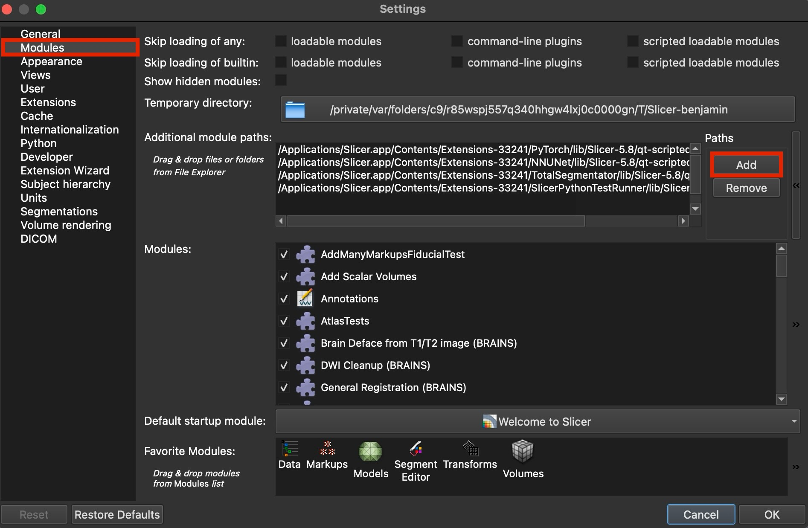
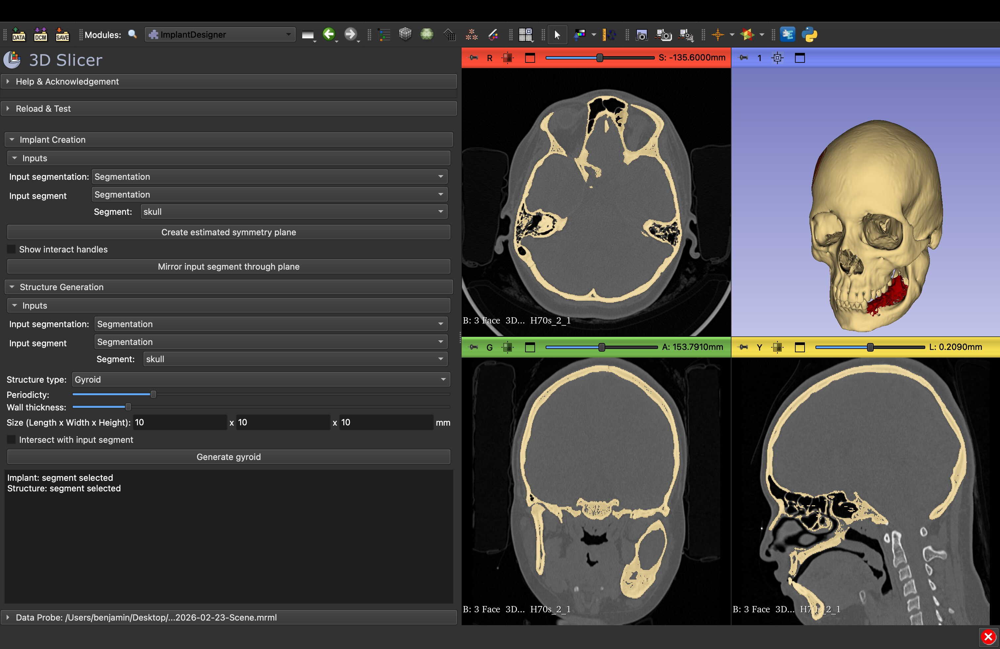
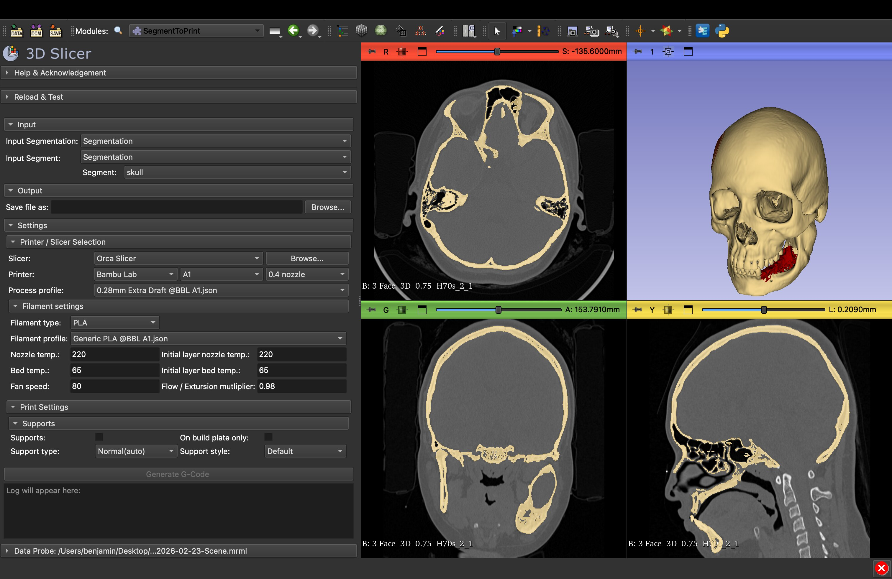

# Patient-Specific Implant (PSI) Design and Printing Extension for 3D Slicer

This repository contains the source code for two interconnected software modules developed for **3D Slicer** as part of a bachelor's thesis.

The extension automates the preoperative engineering and geometric design of craniofacial patient-specific implants (PSIs), including the generation of internal porous Gyroid structures. Furthermore, it integrates a direct G-code generation workflow using the Orca Slicer engine, eliminating the need for external software switching.

## 1. Prerequisites
Before installing this extension, ensure you have the following software installed:
* **3D Slicer:** Version 5.8.1.
* **Orca Slicer:** Version 2.3.1 (required for the G-code generation module).
  * *Note: Module B automatically detects Orca Slicer if it is installed in the default system directory:*
   * *macOS: `/Applications/OrcaSlicer.app/Contents/MacOS/OrcaSlicer`*
   * *Windows: `C:\Program Files\OrcaSlicer\orca-slicer.exe` (or `OrcaSlicer.exe`)*
  * *If installed elsewhere, you will need to locate the executable manually within the module's GUI using the "Browse" button.*

## 2. Installation
1. Download this repository or extract the provided ZIP archive.
2. Launch 3D Slicer.
3. In the top menu, navigate to 'Edit' -> `Application Settings`.
4. Select the `Modules` tab from the left panel.
5. In the *Additional module paths* section, click the `>>` (Add) button and select the directory containing the source code of this extension.

6. Restart 3D Slicer. The custom modules will now be available in the module drop-down menu under the **Cranial Implants** and **3D Printing** categories.

## 3. Usage

### Module A: ImplantDesigner

* **Function:** Automates the creation of a patient-specific implant using Boolean operations and allows the integration of a porous internal structure.
* **Workflow:**
  1. Load a segmented model of the anatomical defect (from a CT scan).
  2. Select the input segment and generate a symmetry plane (Edit the symmetry plane using interact handles if needed).
  3. Mirror the healthy side to reconstruct the defect geometry (Edit mirrored segment in Segment Editor if needed).
  4. Generate a Triply Periodic Minimal Surface (TPMS) Gyroid structure within the implant volume (adjustable periodicity and wall thickness).

### Module B: SegmentToPrint

* **Function:** Direct G-code generation for FDM 3D printing from within the 3D Slicer environment.
* **Workflow:**
  1. Select the target implant segmentation.
  2. **Verify the Slicer Path:** Check the Orca Slicer drop-down menu. If the path is empty (auto-detection failed), click the **Browse** button to manually select the Orca Slicer executable.
  3. Choose your printer brand (Bambu Lab / Prusa), model, and nozzle size.
  4. Select the material (PLA, PETG, ABS, etc.) and fine-tune printing parameters (temperatures, flow ratio).
  5. Configure support structures if needed.
  6. The module will execute the Orca Slicer engine in the background and output a ready-to-print `.gcode` file to your chosen directory.

## 4. Author
* **Name:** Benjamín Kubinec
* **Institution:** Brno University of Engineering, Faculty of Mechanical Engineering
* **Year:** 2026
